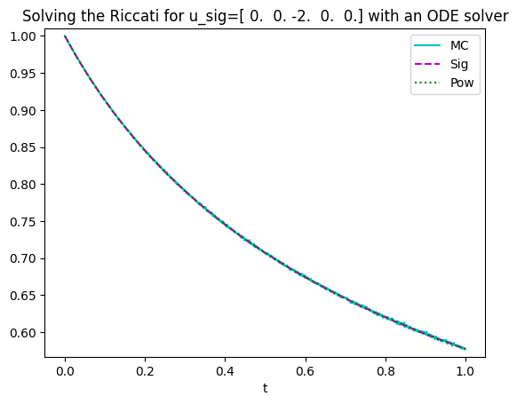

aff_poly_sig: Affine and polynomial methods for signatures
================

<!-- WARNING: THIS FILE WAS AUTOGENERATED! DO NOT EDIT! -->

## Theoretical results

The code proposed here is based on the results of the following papers.

- C. Cuchiero, G. Gazzani, J. Möller, and S. Svaluto-Ferro. Joint
  calibration to SPX and VIX options with signature-based models. ArXiv
  e-prints, 2023. https://arxiv.org/abs/2301.13235.

- C. Cuchiero, S. Svaluto-Ferro, and J. Teichmann. Signature SDEs from
  an affine and polynomial perspectiv. ArXiv e-prints, 2023.

## How to install

After cloning the repository, `cd` (change directory) to the repo and
enter this into your terminal:

``` sh
pip install -e .
```

## How to use

### Expected signature and moments of a polynomial process

The goal of this code is to compute the expected signature
$\mathbb E[\mathbb X_T]$ of a polynomial process $X$. In the one
dimensional case it also provides an expression for its moments. As a
first step import the following functions.

``` python
from aff_poly_sig.exp_sig import expsig, withwords, expsig_withwords, moments
```

Next, define the parameters of the polynomial process of interest. Given
the drift vector $$b(X_t)^i=b_i+\sum_{j=0}^db_{ij}X_t^j,$$ and the
diffusion matrix
$$a(X_t)^{ij}=a_{ij}+\sum_{k=0}^da_{ijk}X_t^k+\sum_{k,h=0}^da_{ijkh}X_t^kX_t^h,$$
we use the following parametrisation of the characteristics Coefficients
need then to be saved in a tuple as illustrated in the code below.
Define also the initial condition $x_0$.

For this example we consider a one dimensional Jacobi process without
drift setting $b(X_t)^0=0$ and $a(X_t)^{00}=X_t^0(1-X_t)^0$. We set
$x_0=1/2$.

``` python
import numpy as np

#Dimension of the process
dim=1

#Coefficients of the characteristics
b_const=np.zeros(dim)
b_lin=np.zeros((dim,dim))
a_const=np.zeros((dim,dim))
a_lin=np.zeros((dim,dim,dim))
a_quad=np.zeros((dim,dim,dim,dim))

a_lin[0]=1
a_quad[0]=-1

coeff=(b_const,b_lin,a_const,a_lin,a_quad)

x0=np.zeros(dim)
x0[0]=1/2
```

The last parameters to define are given by the lenght of the expected
signature we would like to compute (`len_max`) and the time at which we
would like to do it (`T`).

``` python
len_max=10
T=1
```

To get the expected signature we can then use the function
[`expsig`](https://sarasvaluto.github.io/AffPolySig/exp_sig_poly_proc.html#expsig).

``` python
expsig(coeff,x0,len_max,dim,T)
```

      0%|          | 0/10 [00:00<?, ?it/s]

    array([1.00000000e+00, 0.00000000e+00, 7.90150699e-02, 0.00000000e+00,
           1.45583443e-03, 0.00000000e+00, 1.14548260e-05, 0.00000000e+00,
           4.94622744e-08, 0.00000000e+00, 1.34438690e-10])

To obtain a better readable output one can use the function
[`withwords`](https://sarasvaluto.github.io/AffPolySig/exp_sig_poly_proc.html#withwords).

``` python
E=expsig(coeff,x0,len_max,dim,T)
withwords(E,dim)
```

      0%|          | 0/10 [00:00<?, ?it/s]

    [[1.0, []],
     [0.07901506985356974, [0, 0]],
     [0.0014558344297645905, [0, 0, 0, 0]],
     [1.145482602482784e-05, [0, 0, 0, 0, 0, 0]],
     [4.94622743536099e-08, [0, 0, 0, 0, 0, 0, 0, 0]],
     [1.3443868989326117e-10, [0, 0, 0, 0, 0, 0, 0, 0, 0, 0]]]

The same result can be obtained directly using
[`expsig_withwords`](https://sarasvaluto.github.io/AffPolySig/exp_sig_poly_proc.html#expsig_withwords),
which combines the two steps above.

``` python
expsig_withwords(coeff,x0,len_max,dim,T)
```

      0%|          | 0/10 [00:00<?, ?it/s]

    [[1.0, []],
     [0.07901506985356974, [0, 0]],
     [0.0014558344297645905, [0, 0, 0, 0]],
     [1.145482602482784e-05, [0, 0, 0, 0, 0, 0]],
     [4.94622743536099e-08, [0, 0, 0, 0, 0, 0, 0, 0]],
     [1.3443868989326117e-10, [0, 0, 0, 0, 0, 0, 0, 0, 0, 0]]]

In one dimension (`dim`=1) we can also use the function
[`moments`](https://sarasvaluto.github.io/AffPolySig/exp_sig_poly_proc.html#moments)
to compute the moments of the process.

``` python
moments(coeff,x0,len_max,dim,T)
```

      0%|          | 0/10 [00:00<?, ?it/s]

    array([1.        , 0.5       , 0.40803014, 0.36204521, 0.33448524,
           0.31613774, 0.30305083, 0.29324856, 0.28563369, 0.27954838,
           0.2745743 ])

### Laplace transform in the Brownian setting

The goal of this code is to compute the Laplace transform
$\mathbb E[e^{\langle \mathbf u^{sig}, \mathbb X_t^{sig}\rangle}]$ and
$\mathbb E[e^{\langle \mathbf u^{pow}, \mathbb X_t^{pow}\rangle}]$,
where $X$ denotes a Brownian motion and $\mathbb X^{sig}$ and
$\mathbb X^{pow}$ the corresponding extensions. Precisely, we consider
the following two extensions: the signature
$$\mathbb X_t^{sig}:=(1,X_t,\frac {X_t^2}2,\ldots),$$ and the power
sequence $$\mathbb X_t^{pow}:=(1,X_t,X_t^2,\ldots).$$ As a first step
import the following functions.

``` python
from aff_poly_sig.riccati_bm import appr_exp_sig, appr_exp_pow, MC, CoD
```

Next, we introduce the parameters of interest. We in particular have `T`
for the time horizon, `K_u` for the lenght of (the approximation of)
$\mathbf u^{sig}$ and $\mathbf u^{pow}$, `u_sig` for $\mathbf u^{sig}$
with the signature’s extension, and `u_pow` for $\mathbf u^{pow}$ with
the power sequence’s extension. As an example we compute
$$\mathbb E[\exp(-2\frac{X_t^2}2)]=\mathbb E[\exp(-X_t^2)]$$ for each
$t\in[0,T]$, where $X$ denotes a Brownian Motion and $T=1$. The
corresponding parameters are given in the following cell.

``` python
import math 
import matplotlib.pyplot as plt

T=1 # [0,T] time horizon

#u in terms of the sig lift
K_u=5
u_sig=np.zeros(K_u) 
u_sig[2]=-2

#u in terms of the powers lift
u_pow=u_sig.copy()
for k in range(0,K_u):
    u_pow[k]=u_pow[k]/math.factorial(k)
```

One then just needs to fix the computational parameters, namely the grid
for the computation of the signature (`timegrid`) and the trucation’s
level `K` for the solution.

``` python
n_time=1000
timegrid = np.linspace(0,T,n_time)
K=30
```

The desired Laplace transform can then be computed using
[`appr_exp_sig`](https://sarasvaluto.github.io/AffPolySig/riccati_bm.html#appr_exp_sig)
and
[`appr_exp_pow`](https://sarasvaluto.github.io/AffPolySig/riccati_bm.html#appr_exp_pow).
The finals `sig` and `pow` denote the employed extensions.

``` python
L_sig=appr_exp_sig(u_sig,timegrid,K)
L_pow=appr_exp_pow(u_pow,timegrid,K)
```

To test the results, one can compare them to the results obtained by a
Monte Carlo approximation. That’s what the
[`MC`](https://sarasvaluto.github.io/AffPolySig/riccati_bm.html#mc)
function does.

``` python
N=100000 # number of samples
n_MC=1000 # number of times ticks
MonteCarlo = MC(u_sig,T,n_MC,N)
```

      0%|          | 0/1000 [00:00<?, ?it/s]

``` python
#Monte Carlo
#MonteCarlo_CoD = CoD(np.real(MonteCarlo),n_MC, n_time)
plt.plot(np.linspace(0,T,n_MC),MonteCarlo,'c',label='MC');

#Sig Lift
plt.plot(timegrid,L_sig,'m--',label='Sig');

#Pow Lift
plt.plot(timegrid,L_pow,'g:',label='Pow');

plt.ylim(min(MonteCarlo.real-0.01),max(MonteCarlo.real)+0.01)
plt.xlabel("t")
plt.title(f'Solving the Riccati for u_sig={u_sig.real} with an ODE solver')
plt.legend();
```


